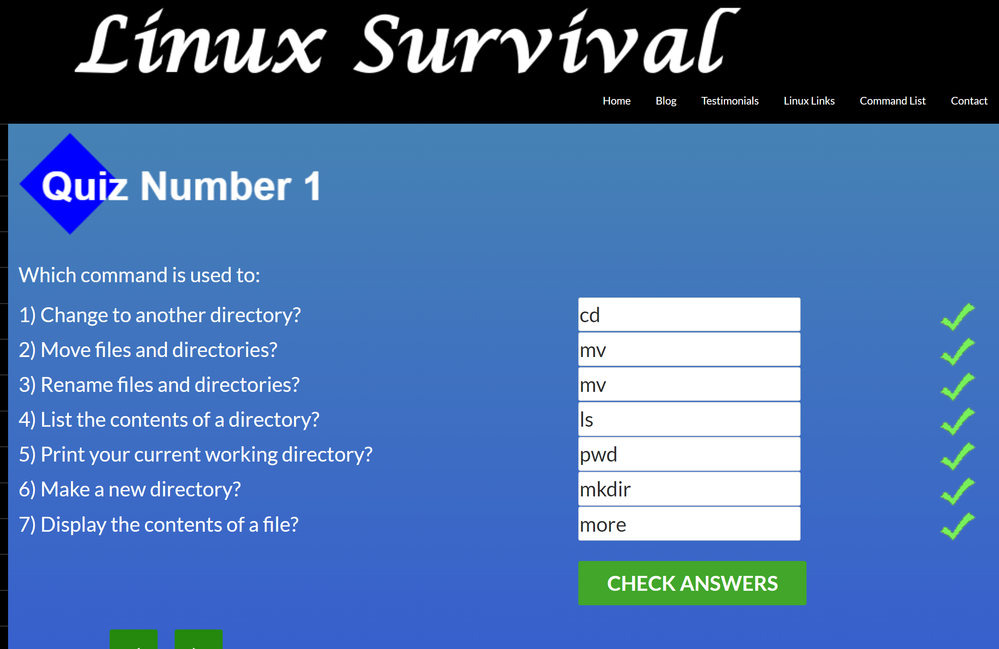

# kottans-frontend
курс з Frontend від Kottans

## Linux CLI, and HTTP

###### Що було цікавого  і корисного:
- багато нових команд Linux, котрі раніше не використовував
- перенаправлення виводу в файл
- перенаправленя результату команди в іншу команду
